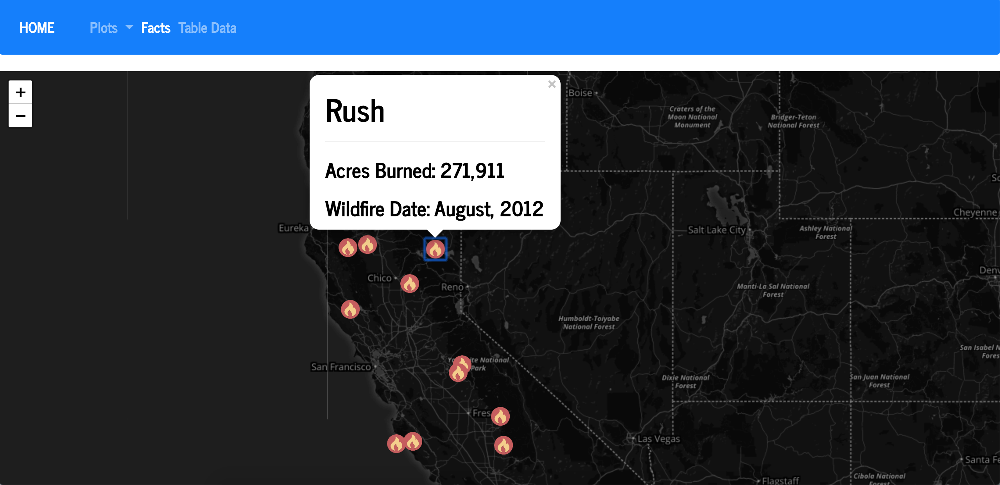
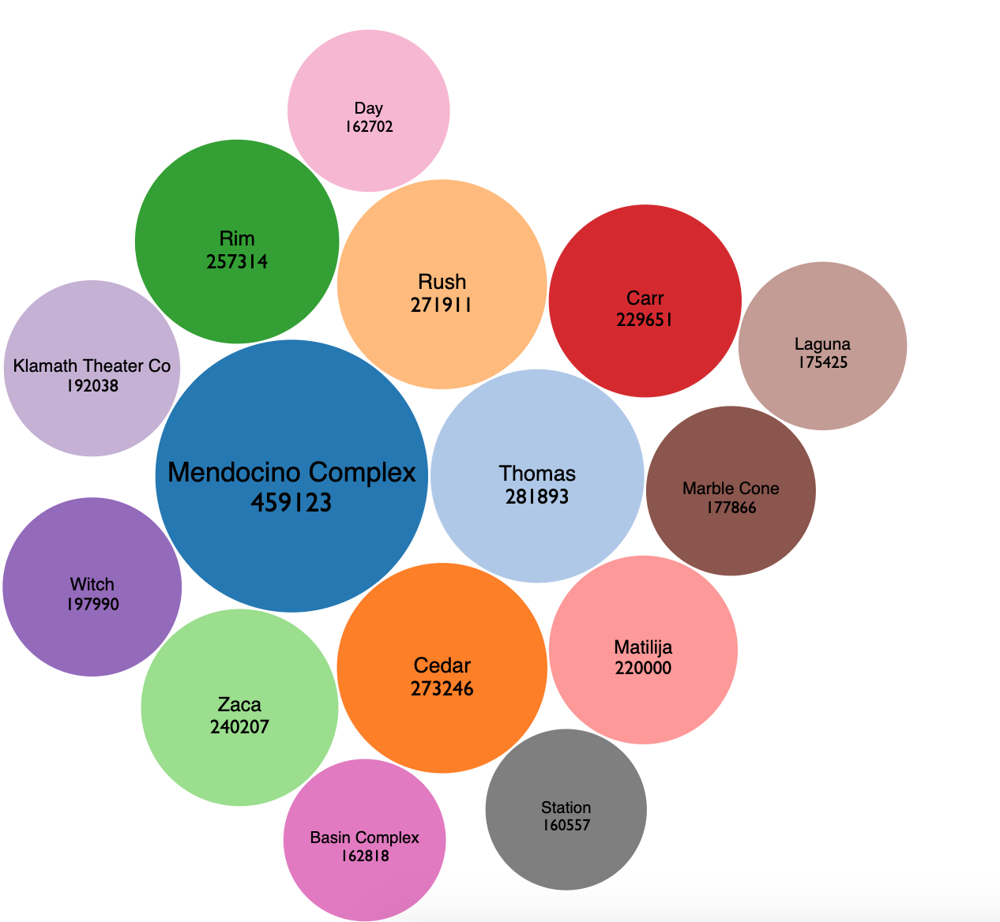
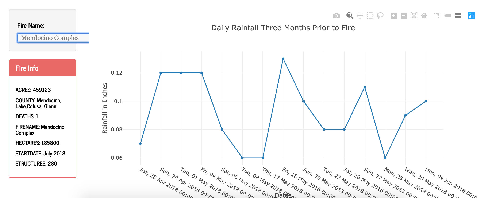

# California WildFires and Rainfall

This is a website that visualizes California Wild Fires from 1980 to 2016. Examined whether there is a relationship between severity of wildfires and rainfall. 

The data is stored in a postgresSQL database, converted to JSON format, and served by a Python Flask app. The website includes four options in the navigation bar and they are Home, Plots, Facts, and Table Data. The Plots page displays a bubble chart created using a D3 library, a map of California created using the Javascript library Leaflet, and a line chart created using Plotly.js. The Facts page contains insightful information about California wildfires, such as the deadliest wildfire, and the largest wildfire. As for the Table Data page, there is a table of wildfires that is scraped from Wikipedia using Beautiful Soup and Pandas.

The top 15 largest wildfires are shown as fire icons on the map under the Plots dropdown menu. Clicking on each fire icon displays the name of the fire, the number of acres burned from the fire, and the date of the fire. The size of the bubbles in the bubble chart reflects the size of the fires relative to how many acres were burned by that fire. The line chart shows daily rainfall data three months prior to the fire. Selecting a fire on left automatically updates the line chart. 
       

